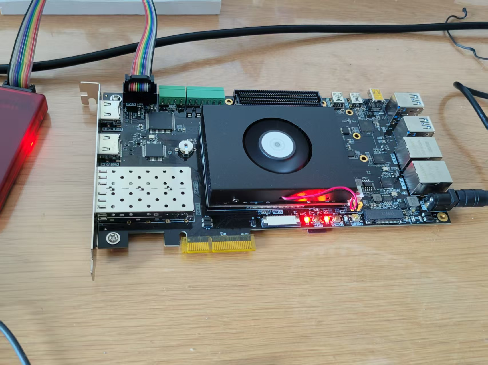

# Zynq PS-PL AXI Hardware MAC Accelerator

A hybrid hardware/software project for Xilinx Zynq MPSoC demonstrating a pipelined Multiply-Accumulate (MAC) hardware accelerator. This project compares the execution paradigms and performance differences between **AXI-Lite (MMIO)** and **AXI-Stream (Direct Memory Access)** interfaces on an FPGA.

---

## Video Demo

### Full Demonstration 

[](https://www.youtube.com/watch?v=TgjB949D7yg)

### Quick Overview

[](https://www.youtube.com/watch?v=jgJ3p5V3GdQ)

## Project Overview

This repository contains both the SystemVerilog RTL for the Programmable Logic (PL) and the bare-metal C driver for the Processing System (PS). 

The accelerator takes a 16-bit input array X, multiplies it by a configurable 16-bit scalar Y, and continuously accumulates the result into a 32-bit register. It provides an interactive UART console to dispatch calculations, change scalars on the fly, and benchmark communication overhead.

### Key Features
* **Dual AXI Interfaces:** Supports single-shot AXI-Lite polling and high-bandwidth AXI-Stream DMA bursts.
* **Asynchronous Clocking:** AXI-Lite bus runs at 100 MHz for control logic, while the AXI-Stream datapath runs at 200 MHz to maximize throughput.
* **Bare-Metal C Driver:** Fully standalone execution using `xaxidma`, `xil_cache`, and `xtime_l` hardware timers.
* **Automated Data Verification:** The ARM processor calculates expected results and verifies 100% of the stream data returned from the PL, properly handling 32-bit hardware rollover math.

---

## Architecture Design

### 1. Programmable Logic (PL)
* **`top_stream_acc.sv`:** The top-level wrapper managing the AXI interfaces and Clock Domain Crossing (CDC).
* **`pipelined_mac`:** The core DSP logic. Calculates `Result = Result + (X * Y)`.

### 2. Processing System (PS)
* **AXI-Lite Memory Map:**
  * `0x00` (REG0): Scalar Y Configuration
  * `0x04` (REG1): Single Input Data X
  * `0x08` (REG2): FSM Status (0=IDLE, 1=PROC, 2=DONE)
  * `0x0C` (REG3): MMIO Accumulator Result
* **AXI DMA Engine:** Configured in simple transfer mode (Interrupts disabled, polling-based) for high-speed streaming between DDR memory and the PL.

---

## Known Hardware Behaviors & Design Notes

### Continuous DMA Accumulation
To maximize pipelined throughput and avoid complex CDC edge cases on AXI-Stream `tlast` signals, the hardware accumulator does *not* reset between DMA transfers. It retains the total sum indefinitely.

### Software State Tracking
Because the hardware runs continuously, the software C driver tracks the state of the hardware in memory using a persistent `static u32` counter. When the 32-bit hardware register naturally overflows (rolls over past 4,294,967,295), the C driver mirrors this exact same overflow behavior using standard 32-bit unsigned integer math, ensuring the verification sequence never fails.

### MMIO vs. Stream Separation
The AXI-Lite result register (`REG3`) is decoupled from the active AXI-Stream pipeline register to prevent timing violations across clock domains. During DMA streams, the MMIO FSM remains idle.

---

## Usage & Interactive Menu

Once flashed to the Zynq MPSoC, connect via a serial terminal (115200 baud). The C application presents an interactive menu:

```text
===================================================
    PS-PL AXI Hardware MAC Accelerator Interface
===================================================
 Current Scalar (Y) : 3
 Hardware Limit     : 16-Bit Input X (0 to 65,535)
 -------------------------------------------------
  [M] Calculate Single Integer Input (AXI-Lite)
  [V] Run AXI-Lite MMIO Loop Benchmark (N = 1024)
  [D] Run AXI DMA Stream Hardware Benchmark (N = 1024)
  [S] Change Scalar Multiplier (Y)
  [H] Reprint Menu
  [Q] Exit Application
===================================================
```
---

## Current lingering issues

Unfortunately there are still issues that remain to be fixed. This includes: 
1. The PS side of the DMA expectations are not dynamically updated despite the DMA calculations are returning proper values.
2. The AXI-Lite MMIO Loop is currently hanging and cannot return calculated values. 


## FPGA dev board used

The board is an AXU5EV-P board. 

